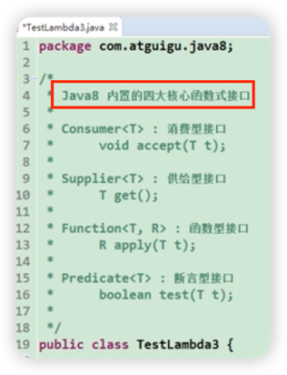
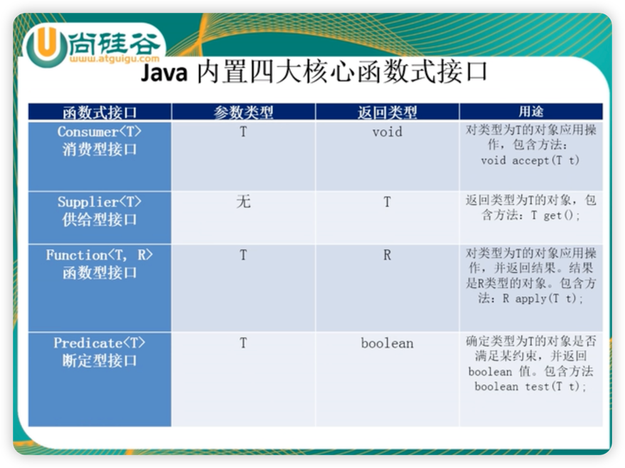
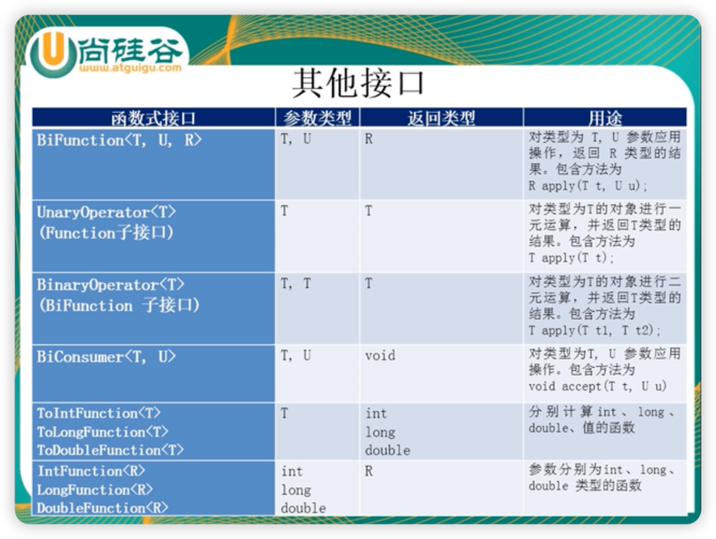

1. lambda 表达式是 java8 提供的语法糖，其本质是匿名内部类

1. 函数式接口@FuntionalInterface:
   是指只有一个抽象方法的接口

1. lambda 表达式的局限 （又称：lambda 表达式需要函数式接口的支持）：
   lambda 表达式代替匿名内部类实现接口时，只适用于 接口本身 只有一个抽象方法的情况（即函数式接口@FunctionalInterface）。
   不过 Java8 的 Interface 中是可以存在 default 方法修饰的 完整方法的。

1. lambda 表达式
参考视频：
https://www.bilibili.com/video/BV1ut411g7E9/
https://www.bilibili.com/video/BV1ut411g7E9?p=3

另一篇博客：
https://blog.csdn.net/qq_45928041/article/details/123894494

1. Java8 内置的四大常用@FunctionalInterface
   
   
1. Java8 内置的其他@FunctionalInterface
   