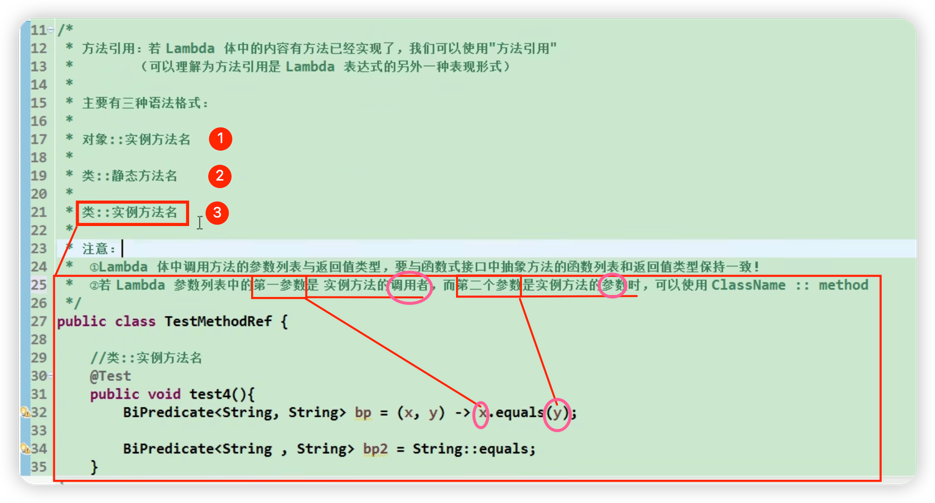

1. 方法调用：是为 lambda 这个语法糖提供的 语法糖
        https://www.bilibili.com/video/BV1ut411g7E9?p=6

   1) 本质是什么？

        使用已存在的普通方法，充当函数式接口中的抽象方法的实现

   1) 前提是什么？
        这个已存在的普通方法，其参数列表及返回值（即方法声明），与
        函数式接口中的抽象方法的 参数列表及返回值（即方法声明）；
        简而言之：已存在的普通方法可以被 copy 到一个新的匿名内部类中直接使用；
        换句话说：匹配是根据方法签名进行匹配的。
   
   1) 为什么要用它？

       由于已存在的普通方法的"参数列表将会被在方法体中如何使用"已经在方法完整定义中被说明过了，
       因此就无须再像定义 普通lambda 表达式一样，在 lambda体 中再写一遍了，
       也就是说只需要函数签名就 OK 了，参数列表 和 lambda 体就都可以省略了，
       而使用 :: 作为函数调用运算符进行方法调用，而不使用普通的小括号（）方法调用运算符行的方法调用，
       是为了告诉编译器这里是在替代 lambda，而不是普通的方法调用。
    
       一言以蔽之：使用可根据上下文推断出参数列表的-已存在的方法来简化 lambda 语法

   1) 三种形式的方法调用语法糖及其前提条件：

       方法引用:若 Lambda 体中的内容有方法已经实现了，我们可以使用"方法引用"
       (可以理解为方法引用是 Lambda 表达式的另外一种表现形式)

    主要有三种语法格式:
        1) 对象::实例方法名
        2) 类::静杰方法名
        3) 类::实例方法名
        注意 :
        @Lambda 体中调用方法的参数列表与返回值类型，要与函数式接口中抽象方法的函数列表和返回值类型保持一致。即二者方法签名必须保持一致。
        @若 Lambda 参数列表中的【第一个参数】 是 "实例方法的调用者"，而【第二个参数】是实例方法的参数时，可以使用 ClassName :: nonStaticMethod
    

   

---

2. 构造器方法引用

3. 数组方法引用（数组也是对象，也有其构造器 new String[8],创建一个长度为 8 的String数组）
