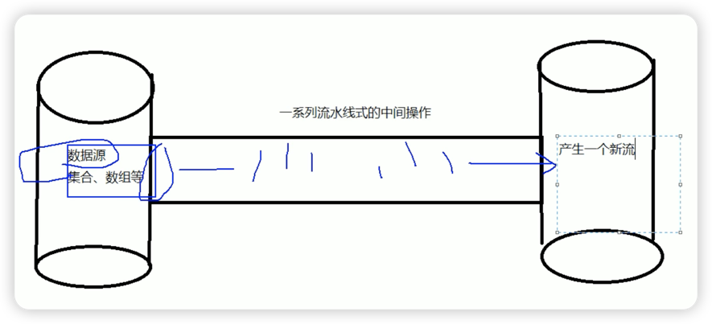
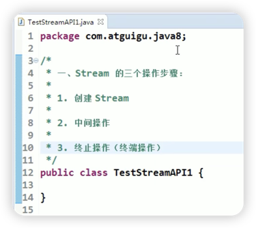
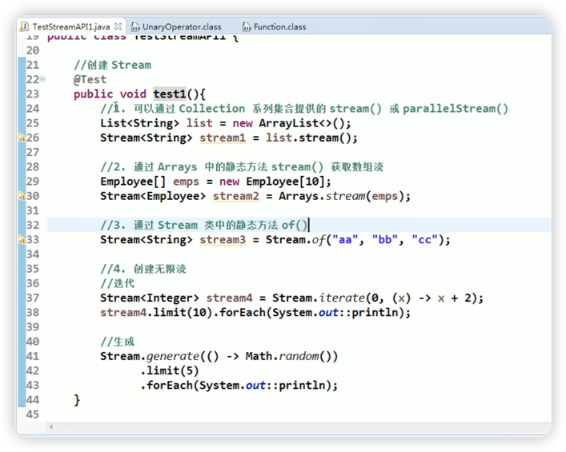
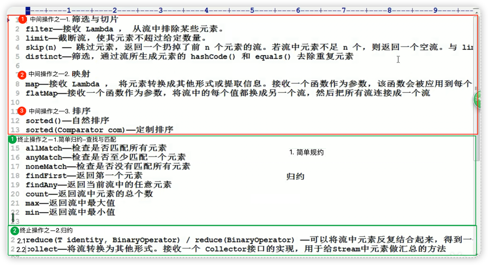
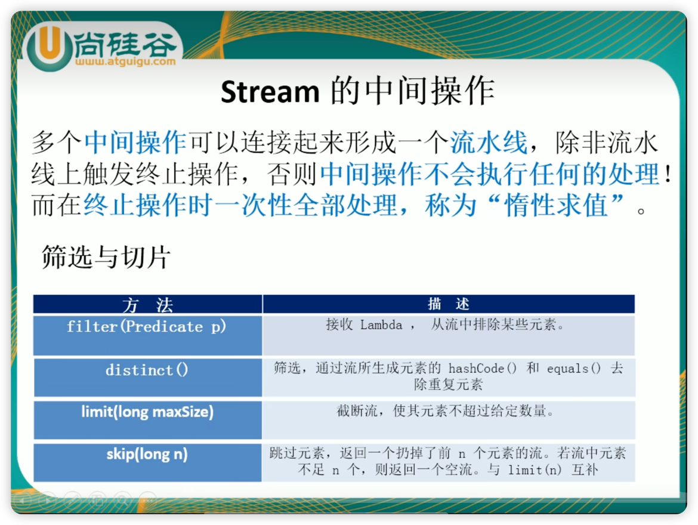
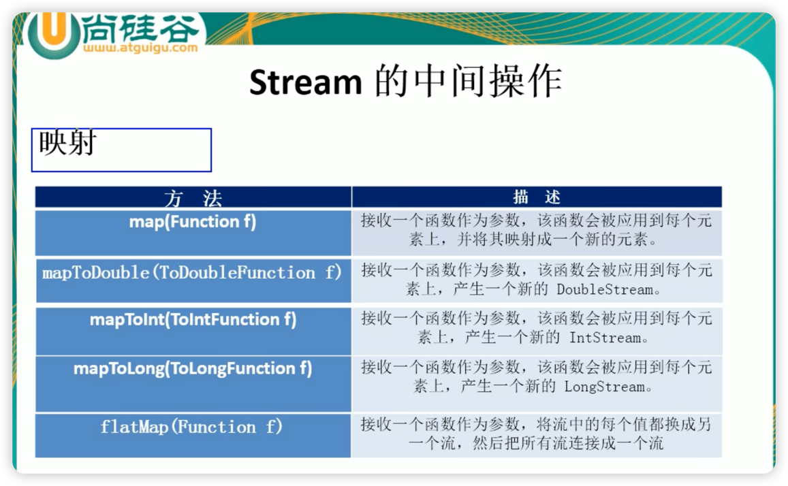
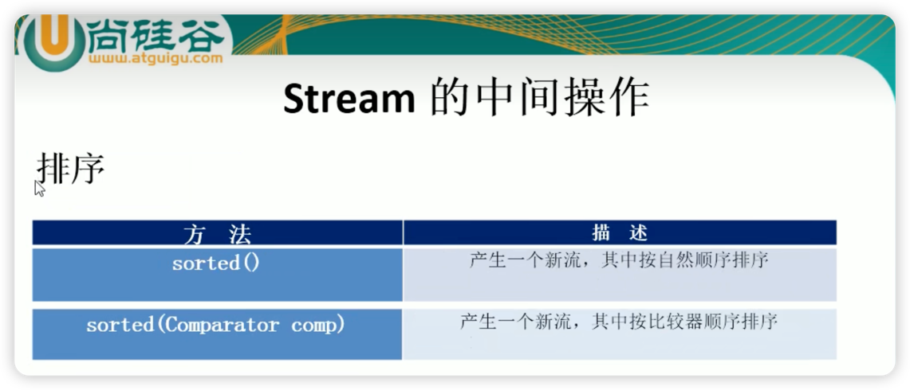
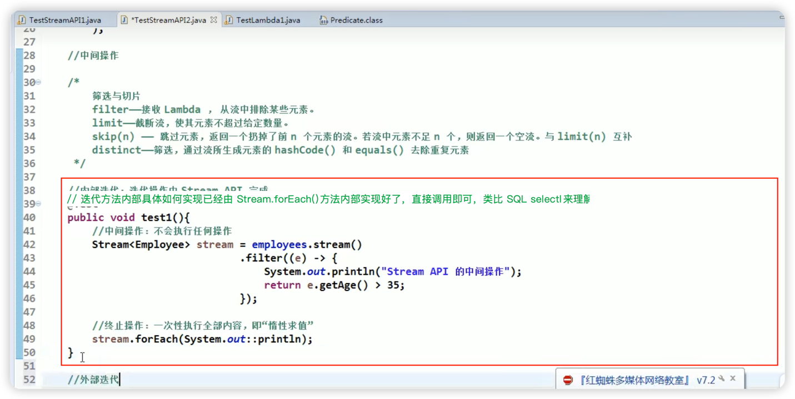
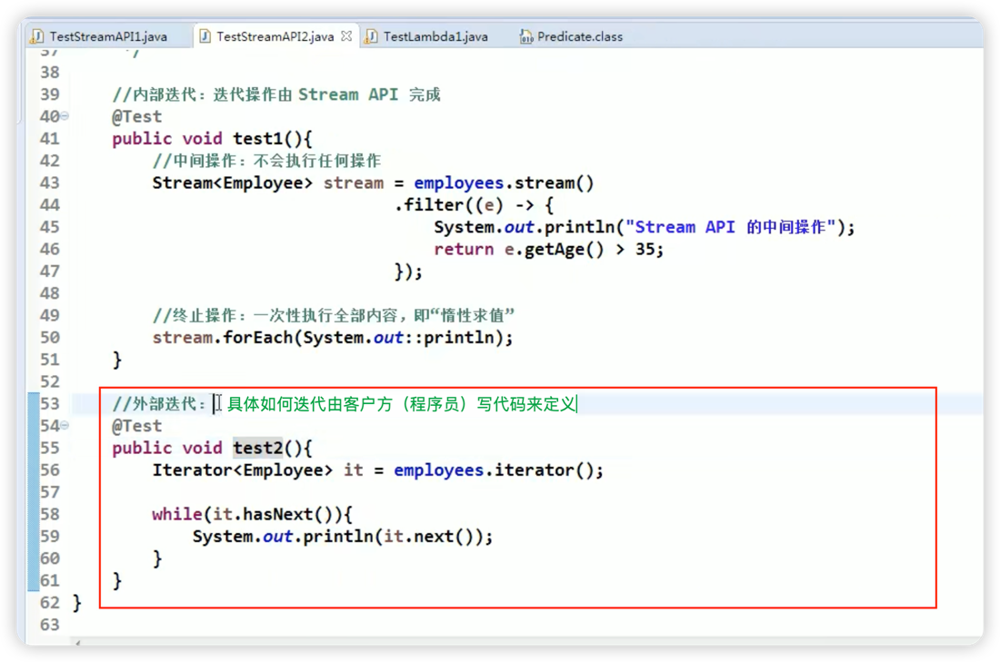
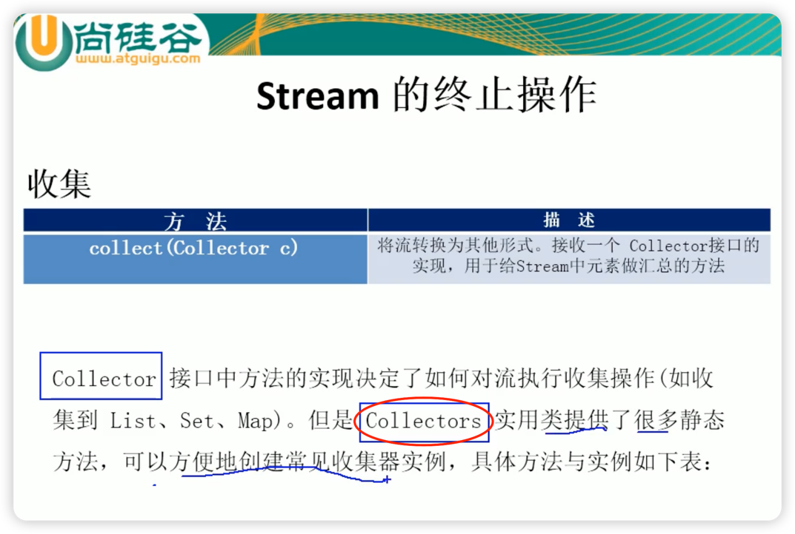

1. 《Java核心技术卷第十版，卷 2》中明确说了，Java8 中的新增的 Stream API 与
    JDK 核心类库中 IO 流中的 Stream 没有任何关系。前者是专为操作集合所开发的 API.

1. Stream API-专用于操作集合-基于 lambda 表达式.md
    https://www.bilibili.com/video/BV1ut411g7E9?p=7

1. 对 Java8 Stream 的三步操作
    

   

1. 获取流的 4 种方式
    

1. Stream API 的中间操作
    
    1. 概览
    
    1. 筛选与切片
    

    1. 映射
    

    1. 排序
    

    1. 流的中间操作与规约总结
---
   1.流的中间操作
   筛选与切片从流中排除某些元素。filter 接收 Lambdalimit截断流，使其元素不超过给定数量。skip(n) - 跳过元素，返回一个扔掉了前 n 个元素的流。若流中元素不足 n 个，则返回一个空流。与 1i1distinct一筛选，通过流所生成元素的 hashCode() 和 equals() 去除重复元素
   映射map 接收 Lambda ， 将元素转换成其他形式或提取信息。接收一个函数作为参数，该函数会被应用到每个flatMap 接收一个函数作为参数，将流中的每个值都换成另一个流，然后把所有流连接成一个流
   排序
   sorted()-自然排序
   sorted(Comparator com)-定制排序
   检查是否匹配所有元素allMatch检查是否至少匹配一个元素anyMatch检查是否没有匹配所有元素noneMatch返回第一个元素findFirst
   findany一返回当前流中的任意元素
   count返回流中元素的总个数
   max一返回流中最大值min 返回流中最小值
   归约
   可以将流中元素反复结合起来，得到reduce(T identity，BinaryOperator)reduce(BinaryOperator)collect一将流转换为其他形式。接收一个 Collector接口的实现，用于给stream中元素做汇总的方法
---

1. 流中间操作详解
    
        

    

1. 映射
    
    1) map-一接收 Lambda ，将元素转换成其他形式或提取信息。接收一个函数作为参数，该函数会被应用到每个元素上，并将其映射成一个新的元素
   
    2) flatMap--接收一个函数作为参数，将流中的每个值都"换成另一个流"，然后把所有流连"接成一个流",见本工程的类
       com/example/java8news/streamstep2nd/flatmapcustomized/FlatMapCustomized.java
   

1. 归约 : 将流中的值反复结合起来，得到一个新值
    reduce(BinaryOperator)
    Optional<T> reduce(BinaryOperator<T> accumulator);
    <U> U reduce(U identity,   BiFunction<U, ? super T, U> accumulator,   BinaryOperator<U> combiner);
   https://www.bilibili.com/video/BV1ut411g7E9?p=12
   https://www.bilibili.com/video/BV1ut411g7E9?p=13

1. 收集
   https://www.bilibili.com/video/BV1ut411g7E9?p=12
   https://www.bilibili.com/video/BV1ut411g7E9?p=13
    Collector 接口
    Collectors 是 Collector接口的工具类（工厂类），用于创建 Collector 类型的对象，（就像线程池 Executor 接口 有一个工具类 Executors
                （所以对于 Stream 的 collect()方法的掌握，重点是掌握 Collectors 工厂类）
    另外注意他们与 Collections 接口没有关系
    